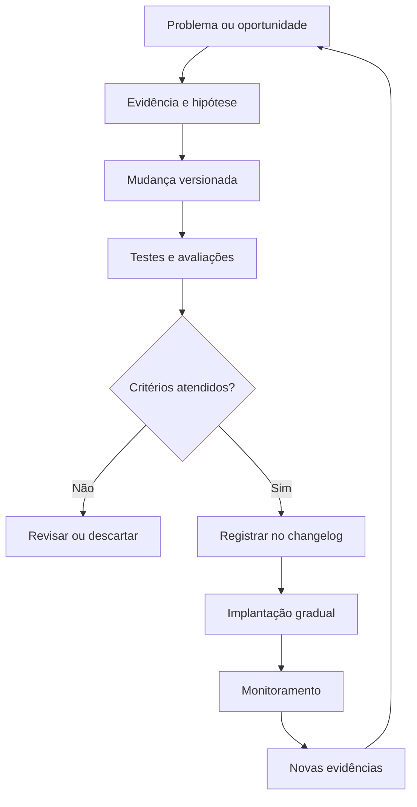
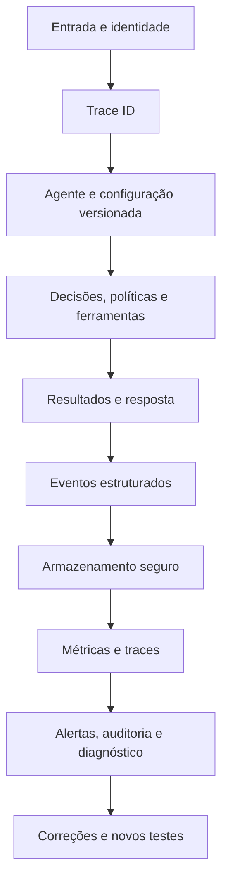

# 1. Resumo do changelog

O **changelog** é o registro versionado das mudanças realizadas no sistema de IA. Ele explica **o que mudou, por que mudou, quem realizou a mudança, quais componentes foram afetados e como validar ou reverter a alteração**.

Seu objetivo é manter a evolução do sistema compreensível, auditável e segura.

### Conteúdo essencial

Cada entrada do changelog deve registrar:

* identificador e data da mudança;
* versão anterior e nova;
* responsável pela alteração;
* motivo ou problema que originou a mudança;
* componentes modificados;
* comportamento esperado;
* riscos conhecidos;
* testes e avaliações realizados;
* métricas antes e depois;
* regressões encontradas;
* decisão de aprovação;
* procedimento de reversão.

### Componentes que devem ser versionados

Em sistemas de IA, não basta versionar apenas o código. O changelog deve abranger:

* código-fonte;
* prompts;
* modelos e provedores;
* parâmetros, como temperatura e limite de tokens;
* fluxos e regras de roteamento;
* ferramentas e integrações;
* bases de conhecimento;
* datasets de avaliação;
* políticas de segurança;
* dependências e infraestrutura.

### Principais funções

#### Rastrear mudanças

Permite identificar qual alteração provocou uma melhoria, falha, aumento de custo ou mudança de comportamento.

#### Comparar versões

Relaciona cada versão aos resultados obtidos em avaliações de:

* qualidade;
* segurança;
* correção;
* uso de ferramentas;
* latência;
* custo;
* confiabilidade;
* experiência do usuário.

#### Detectar regressões

Documenta comportamentos que pioraram após uma mudança. A comparação deve utilizar a versão anterior como referência, os mesmos casos de teste e critérios definidos previamente.

#### Melhorar prompts e fluxos

Registra a evidência que motivou uma alteração, a hipótese testada e os resultados alcançados. Isso evita mudanças baseadas somente em preferência ou intuição.

#### Controlar segurança e conformidade

Mantém histórico de alterações em permissões, políticas, tratamento de dados, ferramentas e controles de segurança. Também demonstra quando e por quem a mudança foi aprovada.

#### Possibilitar reversão

Cada alteração relevante deve indicar como retornar à versão anterior caso sejam detectados erros ou impactos inesperados.

### Fluxo de implementação



### Requisitos para funcionamento correto

Um changelog completo precisa:

* utilizar identificadores únicos e versões imutáveis;
* seguir um formato padronizado;
* estar associado ao controle de versão;
* relacionar mudanças a testes e evidências;
* identificar impactos em qualidade, segurança, custo e latência;
* registrar aprovações;
* documentar incompatibilidades;
* manter plano de reversão;
* ter acesso controlado;
* ser atualizado no mesmo processo que publica uma versão.

### Modelo de entrada

```yaml
change_id: CHG-2026-014
date: 2026-07-15
version_from: 2.3.0
version_to: 2.4.0
responsible: equipe-agentes
components:
  - prompt
  - retrieval-flow
reason: reduzir referências irrelevantes
evidence: 18% das respostas apresentavam fontes inadequadas
changes:
  - novo reranqueamento de documentos
  - redução de 10 para 5 documentos recuperados
evaluation:
  relevance: "+12%"
  cost: "-8%"
  p95_latency: "+3%"
  critical_regressions: 0
approval: approved
rollback: restaurar prompt-v11 e retrieval-v4
```

---

## 2. Resumo do execution log

O **execution log** é o registro estruturado do que aconteceu durante cada execução do sistema. Ele mostra **quem iniciou a operação, quais informações foram usadas, quais decisões foram tomadas, quais ações foram executadas e qual foi o resultado real**.

Seu objetivo é permitir observação, reprodução, diagnóstico, auditoria e monitoramento operacional.

### Conteúdo essencial

Cada execução deve receber um identificador único, como `trace_id`, ligando todos os eventos relacionados:

* identidade do usuário, serviço ou agente;
* data, horário, sessão e ambiente;
* entrada sanitizada;
* versão do código, prompt, modelo e fluxo;
* contexto e documentos recuperados;
* políticas aplicadas;
* decisões operacionais;
* ferramentas chamadas;
* parâmetros utilizados;
* autorizações e aprovações;
* respostas das ferramentas;
* saída final;
* erros, tentativas e timeouts;
* tokens, latência e custo;
* resultado ou efeito produzido.

### Principais funções

#### Reproduzir e corrigir problemas

O execution log preserva as condições necessárias para recriar uma falha em ambiente controlado. Isso inclui versões, entrada, dados recuperados, parâmetros, ferramentas e resultados intermediários.

Como modelos generativos podem variar, reproduzir não significa necessariamente obter o mesmo texto, mas recriar as mesmas condições e observar o comportamento relevante.

#### Controlar latência

O log divide o tempo total entre:

* espera em fila;
* processamento do modelo;
* consultas a dados;
* ferramentas;
* rede;
* processamento interno.

Deve registrar tempo até o primeiro token, tempo total e métricas agregadas como p50, p95 e p99.

#### Controlar custos

Registra:

* tokens de entrada e saída;
* chamadas ao modelo;
* ferramentas e APIs;
* armazenamento;
* tentativas;
* infraestrutura;
* custo estimado por execução.

Esses dados permitem calcular custos por usuário, tarefa, funcionalidade, modelo ou período.

#### Comparar versões

Execuções de diferentes versões podem ser comparadas sobre os mesmos casos. O log fornece respostas, traces, custos, tempos e falhas para os avaliadores.

#### Auditar decisões e ações

A trilha de execução permite responder:

* quem iniciou;
* qual configuração foi utilizada;
* quais políticas foram verificadas;
* qual decisão foi tomada;
* qual ação foi autorizada;
* o que foi efetivamente executado;
* qual resultado foi confirmado.

Devem ser registradas justificativas operacionais curtas, sem depender do raciocínio interno detalhado do modelo.

#### Detectar regressões

O execution log permite comparar métricas da versão de referência com a versão nova, identificando pioras em:

* qualidade;
* segurança;
* uso de ferramentas;
* custo;
* latência;
* erros;
* experiência;
* resultados de negócio.

#### Melhorar prompts e fluxos

Os registros revelam padrões de erro, contexto irrelevante, uso incorreto de ferramentas, repetições, gargalos e respostas de baixa qualidade. Essas evidências fundamentam hipóteses de melhoria.

#### Atender segurança e conformidade

O log fornece evidências sobre acessos, permissões, políticas, aprovações, tratamento de dados e ações do agente. Para isso, os registros precisam ser íntegros, protegidos e sujeitos a retenção controlada.

### Arquitetura de funcionamento



### Formato dos eventos

Os logs devem ser estruturados, preferencialmente em JSON, para permitir pesquisa, agrupamento e geração de métricas.

```json
{
  "trace_id": "exec-8421",
  "timestamp": "2026-07-15T14:30:00Z",
  "environment": "production",
  "agent_version": "2.4.0",
  "prompt_version": "support-v12",
  "model": "modelo-x",
  "policy_version": "security-v7",
  "decision": "call_knowledge_search",
  "tool": "knowledge_search",
  "tool_status": "success",
  "input_tokens": 740,
  "output_tokens": 216,
  "latency_ms": 1830,
  "estimated_cost": 0.0041,
  "approval_status": "not_required",
  "result": "completed",
  "error": null
}
```

### Segurança dos registros

O execution log não deve armazenar indiscriminadamente todo o conteúdo. Sua implementação precisa incluir:

* mascaramento de dados pessoais;
* remoção de senhas, tokens e chaves;
* criptografia em trânsito e em repouso;
* controle de acesso por função;
* segregação de dados sensíveis;
* período de retenção;
* descarte seguro;
* registro de quem consultou os logs;
* proteção contra alteração;
* hashes, assinaturas ou armazenamento somente para acréscimo.

### Monitoramento e alertas

Os eventos devem gerar métricas e alertas para:

* aumento de erros;
* latência p95 ou p99 acima do limite;
* crescimento inesperado de tokens;
* custo acima do orçamento;
* repetição excessiva;
* ferramentas indisponíveis;
* ações sem autorização;
* violações de políticas;
* tentativa de acesso incomum;
* alteração não esperada de configuração.

### Requisitos para funcionamento correto

Um execution log completo precisa:

* usar um `trace_id` único;
* registrar eventos com horário confiável;
* possuir esquema padronizado;
* correlacionar todas as etapas;
* identificar as versões utilizadas;
* separar tentativa, execução e resultado confirmado;
* calcular latência e custo;
* registrar políticas e autorizações;
* proteger informações sensíveis;
* manter integridade e disponibilidade;
* permitir pesquisa, métricas e alertas;
* ser testado para verificar se os eventos realmente estão sendo registrados.

---

## Relação entre os dois registros

| Pergunta           | Changelog                   | Execution log                      |
| ------------------ | --------------------------- | ---------------------------------- |
| O que mudou?       | Principal função            | Indica a versão executada          |
| Por que mudou?     | Registra motivo e evidência | Mostra o problema observado        |
| O que aconteceu?   | Apresenta efeitos gerais    | Detalha cada execução              |
| Quem alterou?      | Registra o responsável      | Registra quem iniciou ou autorizou |
| Como validar?      | Aponta testes e critérios   | Fornece dados das execuções        |
| Como diagnosticar? | Delimita as mudanças        | Reconstrói o comportamento         |
| Como reverter?     | Documenta o procedimento    | Confirma o impacto da reversão     |
| Como auditar?      | Histórico das versões       | Histórico das ações                |

O funcionamento integrado segue este ciclo:

**o execution log detecta e documenta o comportamento → as evidências orientam a correção → o changelog registra a mudança → avaliações verificam a nova versão → novos execution logs confirmam o resultado em produção.**

Assim, o **changelog explica a evolução do sistema**, enquanto o **execution log demonstra sua operação real**. Juntos, eles sustentam rastreabilidade, diagnóstico, comparação de versões, controle de custos e latência, detecção de regressões, auditoria, segurança e conformidade.

## IMPLEMENTAÇÃO DO CHANGELOG

O changelog ainda não está implementado. O repositório possui requisitos e exemplos documentados, mas faltam os mecanismos que tornam o registro versionado, auditável e verificável.

A maior lacuna é estrutural: `/home/davis/atletas-videos` não é atualmente um repositório Git. Portanto, criar apenas um `CHANGELOG.md` não atenderia aos critérios de [logs.md](/home/davis/atletas-videos/logs.md:90), que exigem associação ao controle de versão, versões imutáveis, evidências, aprovação e reversão.

Nenhum arquivo foi alterado nesta análise.

## Evidências observadas

* Não existe `.git/`, histórico de commits ou tags.
* Não existe `CHANGELOG.md`.
* Não existem `.gitignore`, `pyproject.toml`, arquivo de lock, testes ou CI.
* O código não declara uma versão própria.
* A configuração não possui `schema_version`.
* O script imprime resultados no terminal, mas não gera evidências estruturadas de execução. Isso aparece em [editar_video.py](/home/davis/atletas*videos/editar_video.py:616).
* As dependências estão parcialmente fixadas: apenas `moviepy` está preso a uma versão exata; as demais usam limites mínimos em [requirements.txt](/home/davis/atletas*videos/requirements.txt:1).
* A especificação possui a versão documental `1.0`, mas isso não representa necessariamente a versão do software: [ESPECIFICACAO.md](/home/davis/atletas*videos/ESPECIFICACAO.md:1).
* O próprio planejamento já prevê changelog, SemVer, tags, versões do schema e manifesto de execução em [PROJETO.md](/home/davis/atletas-videos/PROJETO.md:660).

## Ações necessárias

| Ordem | Ação | Modo | Critério de aceitação |
| ---: | --- | --- | --- |
| 1 | Definir a governança de versões | `ASSISTIDA` | SemVer adotado; responsáveis por criação e aprovação definidos; mudanças `major`, `minor` e `patch` classificadas; política documentada |
| 2 | Sanear e inicializar o controle de versão | `AUTO/ASSISTIDA` | Git inicializado; `.gitignore` exclui `.venv`, `__pycache__`, vídeos reais, saídas e temporários; nenhum dado sensível entra no primeiro commit |
| 3 | Estabelecer uma baseline honesta | `ASSISTIDA` | Versão inicial aprovada por Davi; tag imutável criada; estado atual preservado; histórico anterior é declarado como indisponível, sem entradas retrospectivas inventadas |
| 4 | Inventariar os componentes versionáveis | `AUTO` | Código, configuração, schema, documentação, políticas, dependências, infraestrutura, ferramentas e datasets de avaliação têm identificadores ou versões recuperáveis |
| 5 | Criar o formato canônico do changelog | `AUTO/ASSISTIDA` | `CHANGELOG.md` criado com formato fixo e uma entrada de baseline; todos os campos obrigatórios de `logs.md` estão representados |
| 6 | Criar identificadores únicos | `AUTO` | Toda mudança usa um ID como `CHG-AAAA-NNN`; IDs duplicados são rejeitados automaticamente |
| 7 | Versionar software, configuração e políticas | `AUTO/ASSISTIDA` | Versão do aplicativo acessível por CLI; configuração contém `schema_version`; políticas e contratos possuem versão; a entrada do changelog informa exatamente quais versões mudaram |
| 8 | Produzir evidências comparáveis | `AUTO/ASSISTIDA` | Testes unitários, contrato, integração e golden tests geram relatórios ligados ao `change_id`; versão anterior e nova são avaliadas com os mesmos casos |
| 9 | Medir impactos | `AUTO` | Cada entrada informa qualidade, segurança, tempo de execução, uso de recursos e regressões antes/depois; métricas não aplicáveis são justificadas como `N/A` |
| 10 | Formalizar aprovação | `MANUAL/ASSISTIDA` | Estado da mudança é `proposta`, `rejeitada` ou `aprovada`; aprovador, data e evidência visual/técnica são registrados |
| 11 | Definir e testar rollback | `AUTO/ASSISTIDA` | A entrada aponta tag/commit anterior, comandos e impacto sobre configurações; restauração é ensaiada em ambiente controlado |
| 12 | Integrar ao processo de release | `AUTO/ASSISTIDA` | Nenhuma tag/release é criada sem changelog válido, testes aprovados, evidências anexadas, aprovação e rollback documentado |
| 13 | Proteger o registro | `ASSISTIDA/MANUAL` | Branch principal protegida no provedor Git; revisão exigida; tags protegidas; acesso limitado; alterações permanecem auditáveis |
| 14 | Correlacionar changelog e execution log | `AUTO` | Cada execução registra `app_version`, `config_schema_version`, commit/tag e, quando aplicável, `change_id`; resultados confirmam ou refutam a mudança |

## Estrutura mínima recomendada

```text
CHANGELOG.md
VERSION
.gitignore
pyproject.toml
uv.lock
schemas/
  video_config.schema.json
changes/
  CHG-2026-001.yaml
tests/
  unit/
  contracts/
  integration/
  golden/
docs/
  VERSIONAMENTO.md
  RELEASE.md
  ROLLBACK.md
  VALIDACAO_VISUAL.md
.github/
  workflows/
    quality.yml
    release.yml
```

O `CHANGELOG.md` serve à leitura humana. Os arquivos em `changes/` fornecem registros estruturados que podem ser validados automaticamente e usados para gerar o changelog.

## Campos obrigatórios de cada mudança

Cada entrada precisa conter, no mínimo:

```yaml
change_id:
date:
version_from:
version_to:
responsible:
approver:
components: []
reason:
evidence:
changes: []
expected_behavior:
known_risks: []
compatibility:
evaluation:
  baseline:
  candidate:
  quality:
  security:
  execution_time:
  resource_usage:
  regressions:
approval:
rollback:
  target_version:
  procedure:
  validation:
```

Isso cobre os elementos exigidos em [logs.md](/home/davis/atletas-videos/logs.md:7): motivo, componentes, comportamento, riscos, avaliações, métricas, regressões, aprovação e reversão.

## Componentes deste repositório que devem entrar no versionamento

* Código: `editar_video.py` e `inspecionar_frame.py`.
* Configuração: `config_exemplo.json` e o futuro JSON Schema.
* Fluxo de renderização: recorte, abertura, slow motion, freeze, grafismos, tracking, continuação e replay.
* Ferramentas: MoviePy, Pillow, OpenCV/CSRT, NumPy, Matplotlib e FFmpeg.
* Políticas: documentos em `contexto/`, especialmente `AGENT_POLICY.md`.
* Requisitos e critérios: `ESPECIFICACAO.md`, `PROJETO.md`, `DESIGN SYSTEM.md` e manual operacional.
* Dataset de avaliação: vídeo sintético, configurações válidas e inválidas, frames de referência e resultados golden.
* Infraestrutura: Python, WSL2/Linux, codecs, FFmpeg e arquivo de lock.
* Dados reais: não devem ser incorporados ao Git; devem ser referenciados por identificador e hash controlado quando necessários para homologação.

Modelos, provedores, temperatura e tokens devem ser registrados apenas se uma IA passar a participar da execução do produto. No estado atual, esses campos são `N/A`. Já documentos como `PROTOCOLO.md` e `Better_IA.md` devem ser versionados caso sejam utilizados como instruções operacionais de agentes.

## Gates de aceitação do changelog

A implementação somente poderá ser considerada aceita quando:

1. toda mudança tiver ID único e versão SemVer;
2. a versão corresponder a um commit e uma tag imutável;
3. todos os componentes afetados forem declarados;
4. houver evidência do problema e do resultado;
5. a mesma avaliação tiver sido executada na baseline e na versão candidata;
6. qualidade, segurança, duração e recursos forem comparados;
7. regressões e incompatibilidades estiverem explícitas;
8. a aprovação humana necessária estiver registrada;
9. o rollback estiver documentado e testado;
10. a publicação for bloqueada quando qualquer campo ou gate estiver ausente;
11. o execution log identificar a versão efetivamente executada;
12. o acesso ao histórico, às branches e às tags estiver controlado.

A ordem prática correta é: **saneamento e Git → baseline → padrão do changelog → testes e métricas → aprovação e rollback → automação de release → correlação com execution logs**.